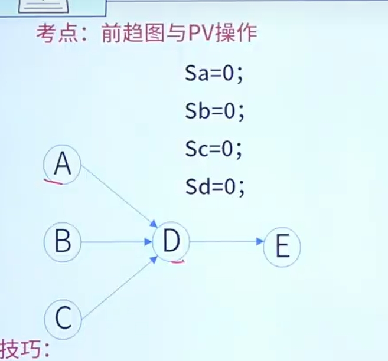
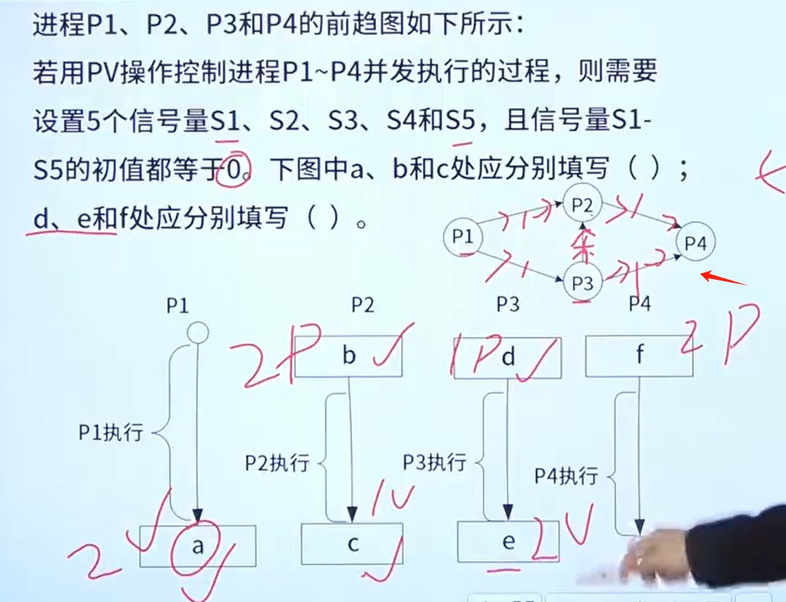
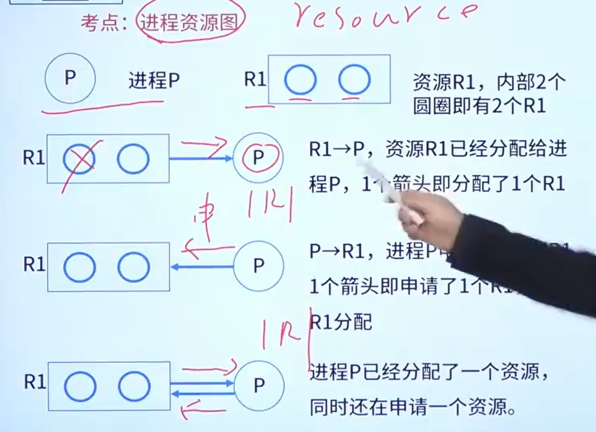
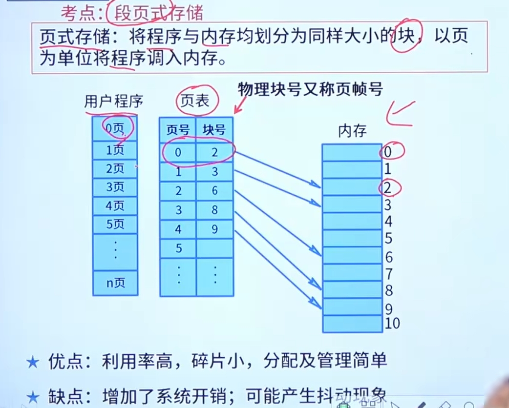
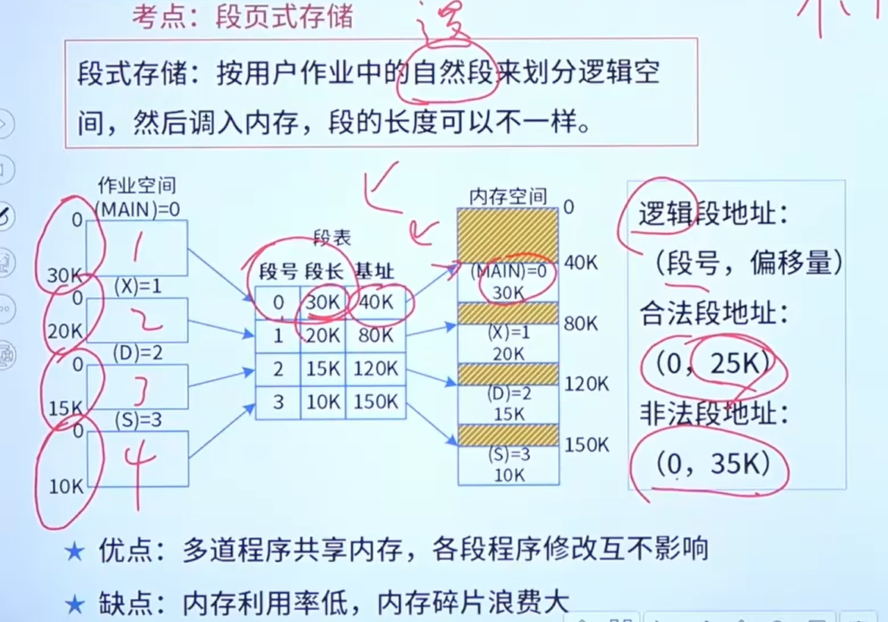
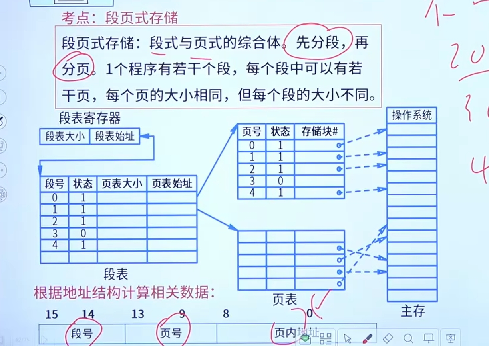

# 操作系统

应用软件 语言处理程序 操作系统 硬件

分类:
分批操作系统
分时操作系统
实时操作系统
分布式操作系统
微机操作系统
嵌入式操作系统:实时性 可靠性 易移植性

# 进程管理
Process
程序在数据集合上运行的过程,它是系统进行资源分配和调度的一个独立单位
组成:程序块(代码块),进程控制块(PCB),数据块

witch程序
动态 和 静态

withc线程
线程私有:程序计数器 栈 寄存器

## 进程的状态:
运行 就绪 阻塞(等待 一般为IO)
引入优先级后,优先级不高的程序 会从活跃挂起成静止
运行 活跃就绪 活跃阻塞 静止就绪 静止阻塞

## 信号量与PV操作
互斥:比方说进程P1 P2都要用打印机
同步:生产者 消费者 消费者执行的时候生产者还没生产 这个时候就要下去等待了
S:资源数量(比方说两个打印机就是2 不管进程数多少) 负数表示等待的进程数
P:要资源(S-1)
V:释放资源(S+1)

## 互斥(共享):先P 后V
同步:先V 后P

## 前趋图(同步) 

Sa Sb Sc Sd 
V(Sa) V(Sb) V(Sc)
然后执行D点的操作 执行P(Sa) P(Sb) P(Sc)
V(Sd) 然后E进程 P(Sd)

## 死锁:
互斥下发生资源占用
不可能发生死锁的最小资源数
进程数*(每个进程所需资源数-1)+1

## 进程资源图

非阻塞 可化简 非死锁

做题思路:先去看R指向P的,这个资源是一定可以给予的,可以把对应的R-1
然后看P指向R的,这是申请资源,如果资源在申请的时候已经为0了那就是阻塞,还有就是非阻塞的

# 存储管理
寄存器 高速缓存 主存 辅存(磁盘)

段页式存储
页式存储系统
逻辑地址 映射到 物理地址(物理块) 页大小一样

段式存储
段落大小不一致  要说明偏移量

段页式存储 两者结合

磁盘管理
磁道 扇区

先来先服务FCFS
最短寻道时间优先SSTF
循环扫描
扫描
